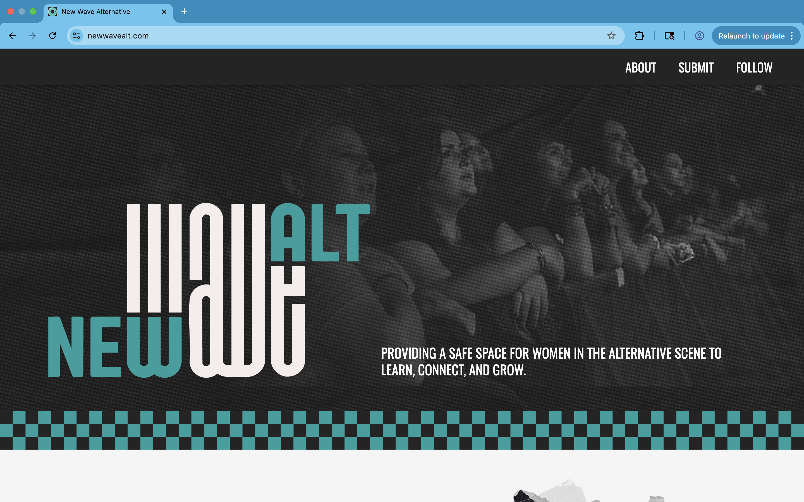
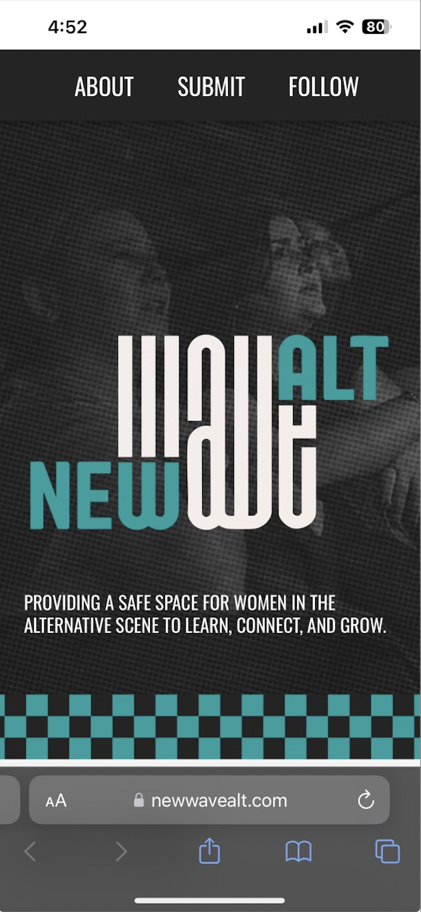

# New Wave Alternative
New Wave Alternative is a women's music collective designed to highlight women working in alternative music and help connect women who are currently working in or aspiring to work in alternative music. This website showcases a backstory to New Wave Alt, a place to submit ideas for features on the New Wave Alt instagram page, and past features linked from instagram.

## Tech Stack
- Frontend: HTML, CSS, JavaScript
- Backend: Node.js, Express
- Hosting: Google Cloud Run, Docker
- Design by New Wave Alt's graphic designer, Luci (https://luciannahhh.com)

## Submissions
- User provides name, contact information, and work samples 
- Uploaded files are processed by multer
- nodemailer sends the submisison via email
- Submissions are reviewed manually

## Screenshots
#### Desktop Version

#### Mobile Version

### Future Enhancement
- Information about networking events hosted by New Wave Alt

